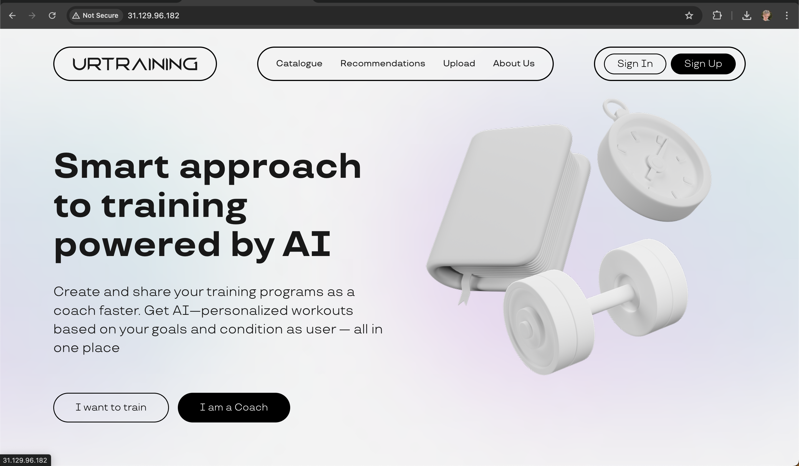
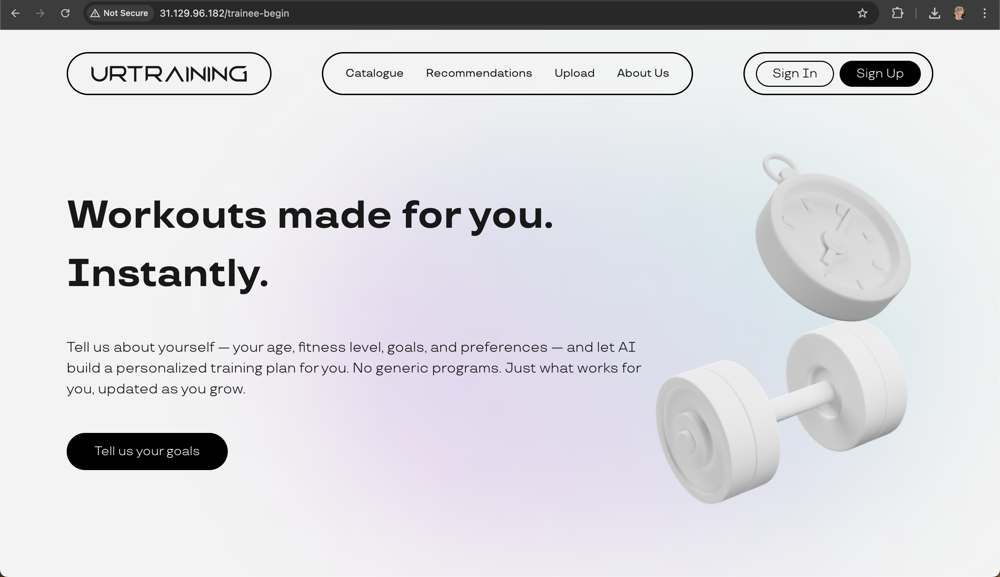
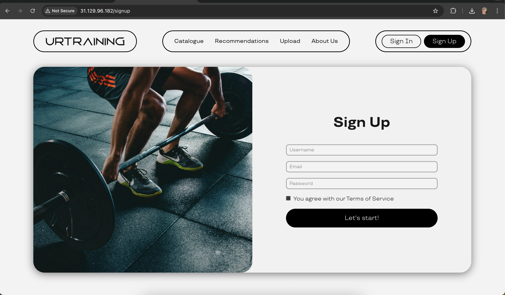
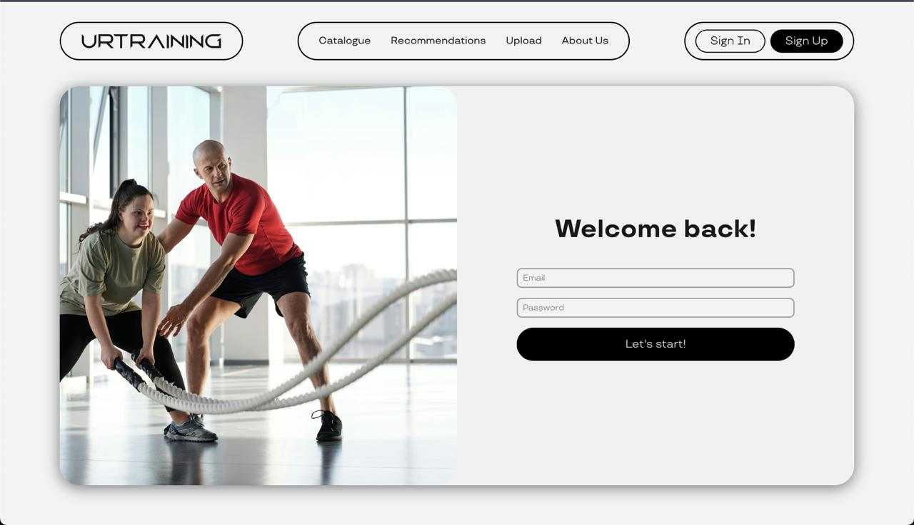
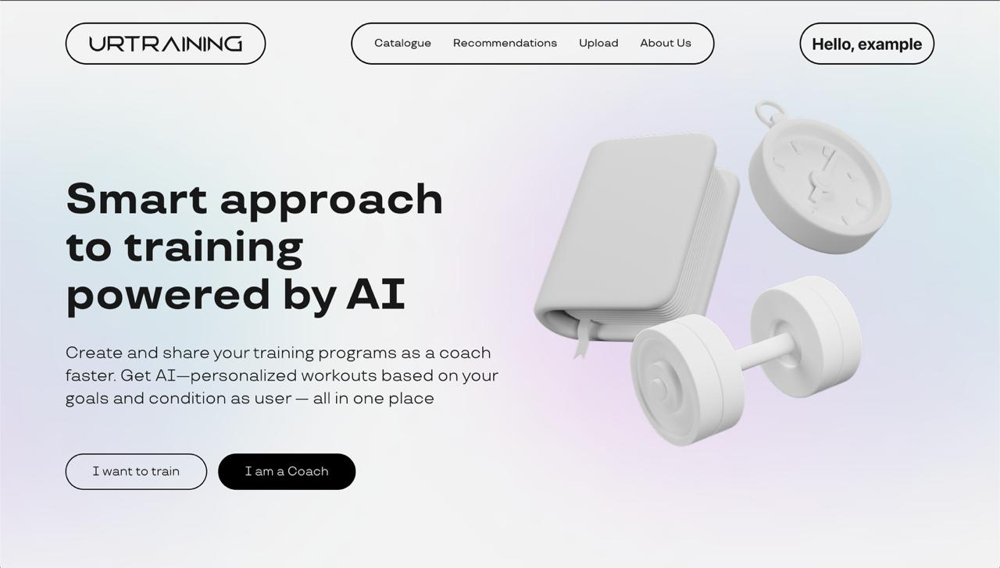
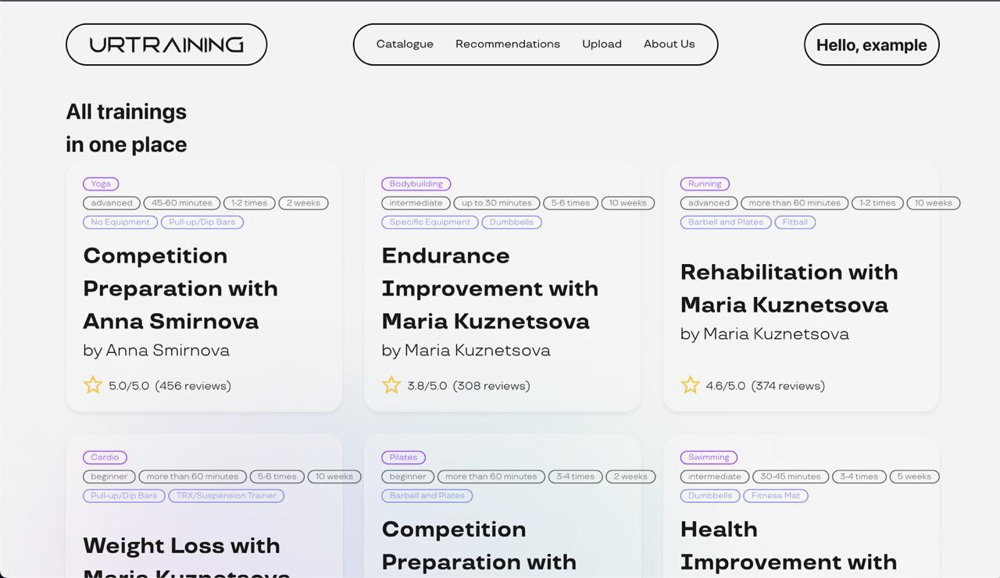
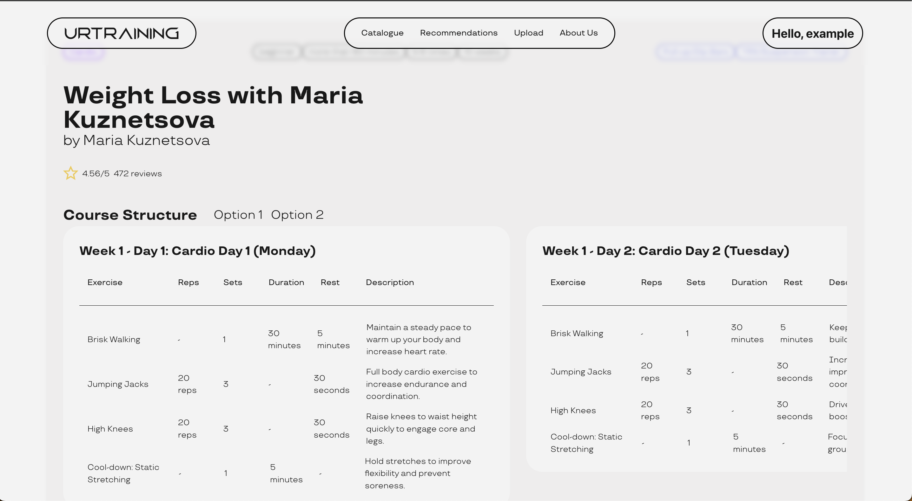

# My Experience with URTRAINING - A User's Journey

## About Me

Hi, I'm Maxim. I'm 26, work in an office, and I've been wanting to get into fitness for a while now. I'm pretty much a beginner when it comes to working out, so I was looking for some online fitness courses I could do at home. Egor told me about this URTRAINING platform that supposedly uses AI to personalize workouts, so I thought I'd give it a try on July 7th, 2025.

---

## My Journey Through the Platform

### Landing Page

When I first landed on the site, I have to admit, it looked pretty good! The design was clean with these cool 3D elements, and I immediately understood that this was about AI-powered, personalized fitness. The choice between "I want to train" and "I am a Coach" was obvious - I clicked on "I want to train" right away.

But here's the thing - I couldn't see any actual courses or examples of what I'd be getting. There was no pricing information either, which made me a bit hesitant. I mean, is this free? Do I need to pay? And there were no reviews, so I had no idea if other people actually liked using this platform. Still, the personalization promise sounded good, so I kept going.

### Pre-Registration Page

After clicking through, I got to this page that explained how they'd personalize everything for me. The "No generic programs" promise really caught my attention - that's exactly what I was looking for! They explained that I'd fill out some questionnaire about my goals and get a customized plan.

What bothered me though was that I still couldn't peek at any courses without signing up. I'm the type of person who likes to browse before committing to anything, you know? Also, they didn't mention how long this questionnaire would take - 5 minutes? 30 minutes? I had no idea what I was signing up for.

### Registration Page

So here's where things got frustrating. I was expecting to fill out that questionnaire about my fitness goals, but instead, I got hit with a registration form! That wasn't what they promised on the previous page.

But the worst part? There was no way to close this modal and go back. No X button, no "close" option, nothing. I felt completely trapped. I either had to register or leave the site entirely. That's not a great feeling when you're just trying to explore a platform.

### Explore other pages

At some point, I tried to check out their course catalog without registering first. Bad idea! A modal popped up saying "Welcome back!" (which was weird since I'd never been there before) asking me to log in. And guess what? No close button on that one either!

I was starting to get really annoyed. Why can't I just browse some courses to see if this platform is worth my time?

### After Registration

Eventually, I gave in and registered. I was hoping for some kind of onboarding flow or that promised questionnaire, but nope - I just got dumped back on the main page with "Hello, example" in the top right corner.

I was completely lost. What am I supposed to do now? Where's that personalization questionnaire? How do I get my custom workout plan? The platform just left me hanging.

### Courses Page

I managed to find the course catalog, and I have to say, the variety looked pretty good. There was yoga, bodybuilding, running, cardio - lots of options. I could see ratings and review counts, which was helpful, and the tags showing difficulty levels and equipment needs were useful.

But I noticed that some tags were broken - like the "10 weeks" tag that didn't fit properly on the page. It made the interface look messy and unprofessional.

Also, I still couldn't find any pricing information. Are these courses free? Do I need to pay per course? A monthly subscription? I had no clue.

### Checking Out a Specific Course

I clicked on this "Weight Loss with Maria Kuznetsova" course to see what I'd actually get. The detail page was quite impressive! It showed the full structure with all the exercises, reps, sets, and duration. The exercise descriptions were detailed and helpful.

But here's the kicker - there was no way to actually start the course! No "Start Course" button, no "Buy Now" button, no "Enroll" button - nothing. It was like looking at a menu at a restaurant but not being able to order anything. What's the point of showing me all these great courses if I can't actually do them?

There were also some visual issues - the right column with Day 2 information was cut off, which made me think the site wasn't properly designed for my screen size.

One more thing that really bothered me - the scrolling through course days was absolutely terrible on my MacBook. The interface felt clunky and unresponsive when trying to navigate between different workout days. It made browsing the course content a frustrating experience.

### Recommendations Page

Remember how they promised AI-powered personalization? Well, I was curious to see what the platform would recommend for me, so I clicked on the "Recommendations" section.

The page went completely white. Nothing loaded. I waited, refreshed, tried again - nothing. It turns out there's a 500 server error happening. The main feature they advertised - personalized recommendations - is completely broken!

**P.S.** Egor pointed out that we actually skipped the questionnaire form entirely, which explains why the recommendations page isn't working - the AI system has no data to generate personalized suggestions from. This is really bad.

---

## Summary

Look, I really wanted to like this platform. The concept sounds great - AI-powered, personalized fitness programs for beginners like me. But the execution is just... not there yet.

#### The Biggest Problems I Encountered:

**Getting Trapped**: Those modal windows without close buttons are a nightmare. I felt forced into registration and couldn't explore freely.

**Can't Actually Use the Courses**: What's the point of showing me all these great courses if there's no way to start them? It's like window shopping at a store where nothing is for sale.

**Broken Core Feature**: The recommendations system - their main selling point - doesn't work at all. That's a pretty big problem.

### What Would Make Me Come Back:

1. Let me browse courses without registering first
2. Fix those modal windows so I don't feel trapped
3. Add actual "Start Course" buttons so I can begin workouts
4. Fix the layout bugs - those floating tags are confusing
5. Tell me how much things cost upfront
6. Make the recommendations system actually work
7. Give me a proper onboarding experience after I register
