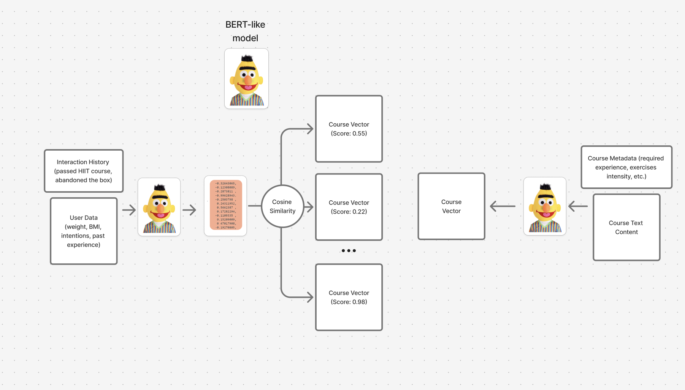

# UrTraining ML System Design

## Overview

The ML system consists of two core components:
- **Recommendation System**: Delivers personalized course recommendations to users
- **Image-to-Tracker**: Converts exercise images into structured tracking programs

## Recommendation System

### Current Approach

Due to limited initial data, the system employs synthetic data generation for the first iteration model training.

### Data Generation Pipeline

#### User Data Structure
- **Profile Data**: Registration form responses (weight, fitness goals, experience level, etc.)
- **Interaction Metadata**: User engagement metrics (completed courses, retention rates, activity patterns)

#### Synthetic Data Generation Process

1. **User Profile Generation**
   - Multiple LLMs (DeepSeek, Gemma, LLaMA) generate diverse user profiles
   - Prompt engineering with seed phrases ensures profile diversity
   - Metadata generation aligned with corresponding user profiles
   - Target: 1,000 training examples for baseline model

2. **Course Data Generation**
   - Multiple LLMs generate the main content of exercises (for gym, swimming or other)
   - For each course type (gym, swimming, others) we generate separate training program 
   - Finally, we align generated courses with coach-provided metadata forms (also generated by LLMs)

3. **Dataset Assembly**
   - For each user profile + metadata, DeepSeek R1 rearranges the courses (generates optimal course-user pairings for training data)

4. **Model Training**
   
   The training process utilizes a bi-encoder architecture to learn meaningful representations of users and courses. It aims to maximize similarity between compatible user-course pairs while minimizing similarity for incompatible ones, enabling effective personalized recommendations through vector similarity search.
   
   **Architecture:**
   - Bi-encoder models (e5, bge-m3, or similar embeddings models)
   - Separate encoding for user profiles and course descriptions
   - Vector generation for both user queries and course documents
   
   **Training Objective:**
   - Contrastive learning approach using triplet, margin, or contrastive loss functions
   - Optimize embeddings to place similar user-course pairs closer in vector space




## Image-to-Tracker System

### Current Implementation

The system utilizes open-source visual language models (VLM) to extract structured data from exercise images.

**Process Flow:**
1. **Image Processing**: Vision-language model analyzes input images
2. **Text Extraction**: Converts visual content to structured JSON format:
   ```json
   [
       {
           "content": "exercise_description"
       }
   ]
   ```
3. **Tracker Mapping**: Each JSON object maps to a dedicated tracker page

#### Future Development (won't be included in MVP)

**Data Collection Strategy:**
- Use images from real coaches to build the dataset
- Annotate those images by DeepSeek or assessors
- Training pair generation: `(image) → (structured_tracker_json)`